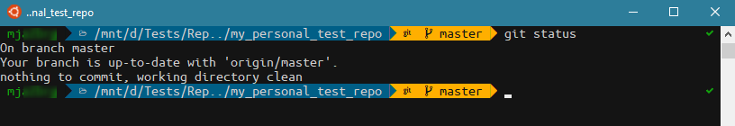
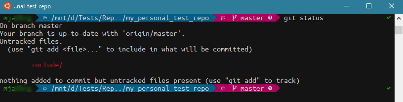
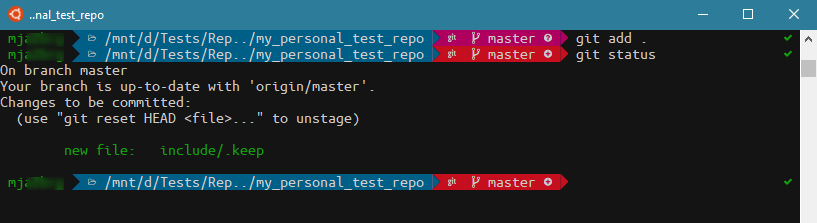
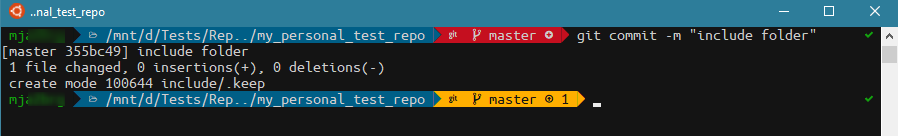
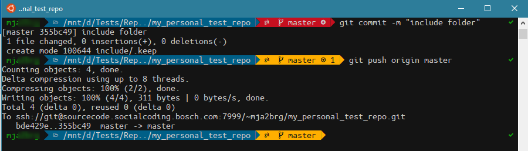
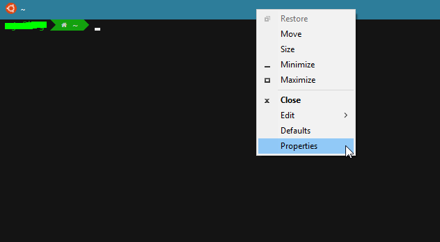
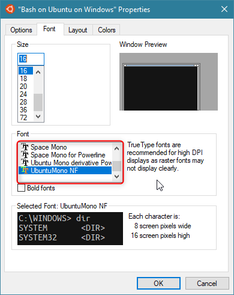

# my_Oh_My_Zsh
My Terminal Setup with Zsh + Oh-My-Zsh + PowerLevel9k + WSL(if needed)

1. Install zsh + oh-my-zsh + PowerLevel9k
3. Configure zsh/oh-my-zsh 
5. Configure Powerlevel9k
5. Installing Powerline Fonts

## Install zsh + oh-my-zsh + PowerLevel9k

#### zsh
```
sudo apt-get install zsh
```
#### oh-my-zsh

sh -c "$(curl -fsSL https://raw.githubusercontent.com/robbyrussell/oh-my-zsh/master/tools/install.sh)"

This will:
    - Write on $HOME/.zshrc
    - Set zsh as default Shell (if typed `y` when asked, if not check the zsh configuration)
    - Create $HOME/.oh-my-zsh directory that contains Oh-My-Zsh scripts and plugins!


#### PowerLevel9k
To install PowerLevel9k just run:
(Make sure you have git installed)
git clone https://github.com/bhilburn/powerlevel9k.git ~/.oh-my-zsh/custom/themes/powerlevel9k


## Configure zsh/oh-my-zsh

If zsh was not set has default in the installation part you need to edit the ~/.bashrc file, otherwise you will need to type zsh every time to open it.
For that, just edit the ~/.bashrc file with `nano ~/.bashrc` (or with your favorite editor) and paste the following lines right after the first comments:
```
if test -t 1; then
exec zsh
fi
```
More zsh configurations in:
https://github.com/robbyrussell/oh-my-zsh


Now is the time to change the theme of oh-my-zsh, which has several cool themes. I am using Powerlevel9k (has you already suspected). So just change the theme in:
```
ZSH_THEME="powerlevel9k/powerlevel9k"
```
## Configure Powerlevel9k

For colors add:
```
export TERM="xterm-256color"
```

My Powerlevel9k configuration:
```
# FONT
POWERLEVEL9K_MODE='nerdfont-complete'

# PROMPT
POWERLEVEL9K_LEFT_PROMPT_ELEMENTS=(context dir dir_writable vcs)
POWERLEVEL9K_RIGHT_PROMPT_ELEMENTS=(status)  
POWERLEVEL9K_COLOR_SCHEME='dark'

# CONTEX
POWERLEVEL9K_CONTEXT_DEFAULT_BACKGROUND="dark"
POWERLEVEL9K_CONTEXT_DEFAULT_FOREGROUND="green"
POWERLEVEL9K_CONTEXT_TEMPLATE="%n"

# VCS -> GIT
POWERLEVEL9K_VCS_GIT_HOOKS=(vcs-detect-changes git-untracked git-aheadbehind git-stash git-remotebranch git-tagname)
POWERLEVEL9K_VCS_CLEAN_FOREGROUND='black'
POWERLEVEL9K_VCS_CLEAN_BACKGROUND='orange1'
POWERLEVEL9K_VCS_UNTRACKED_FOREGROUND='white'
POWERLEVEL9K_VCS_UNTRACKED_BACKGROUND='125'
POWERLEVEL9K_VCS_MODIFIED_FOREGROUND='white'
POWERLEVEL9K_VCS_MODIFIED_BACKGROUND='red'

# COLORS DIR
POWERLEVEL9K_DIR_DEFAULT_BACKGROUND='024'
POWERLEVEL9K_DIR_DEFAULT_FOREGROUND='grey82'
POWERLEVEL9K_DIR_HOME_BACKGROUND='green'
POWERLEVEL9K_DIR_HOME_FOREGROUND='grey82'

# COLORS ROOT
POWERLEVEL9K_CONTEXT_ROOT_FOREGROUND='white'
POWERLEVEL9K_CONTEXT_ROOT_BACKGROUND='red'

# Truncate DIR
POWERLEVEL9K_SHORTEN_DIR_LENGTH=3
POWERLEVEL9K_SHORTEN_DELIMITER=".."
POWERLEVEL9K_SHORTEN_STRATEGY="truncate_from_right"
```
Afterwards it should look somethin like this:
Git repository in Clean mode

Git repository with untracked files

Git repository with modified files

Git repository after commit

Git repository after push


For more configurations visit:
    - https://github.com/Powerlevel9k/powerlevel9k


## Installing Powerline Fonts
If you are on Windows using WSL it can happen that when you open the shell you have something like this:


To fix that you need to install some missing Powerline Fonts. 

```
wget https://github.com/powerline/powerline/raw/develop/font/PowerlineSymbols.otf
wget https://github.com/powerline/powerline/raw/develop/font/10-powerline-symbols.conf
mkdir -p  ~/.local/share/fonts/
mkdir -p ~/.config/fontconfig/conf.d/
mv PowerlineSymbols.otf ~/.local/share/fonts/
fc-cache -vf ~/.local/share/fonts/
mv 10-powerline-symbols.conf ~/.config/fontconfig/conf.d/
```

Fixing this broken theme with the correct font was no piece of cake. The `Ubuntu Mono Nerd Font Complete Mono Windows Compatible.ttf` worked for me. To install just double click to open and click install. (this font is in the repository)

Afterwards run:
```
fc-cache -vf ~/.local/share/fonts/
```
If you are using Bash on Ubuntu on Windows just change the font in the Properties as shown bellow:




